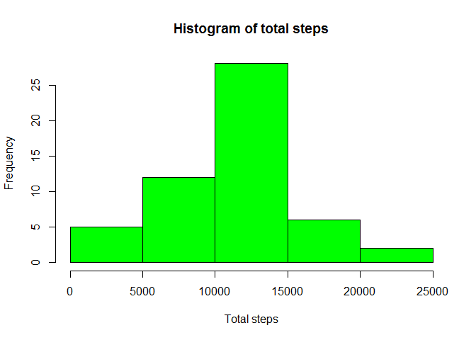
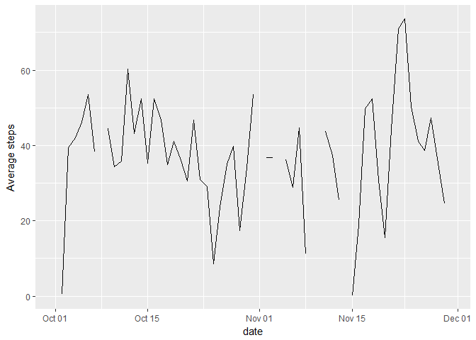
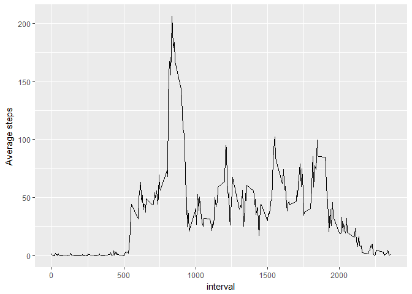
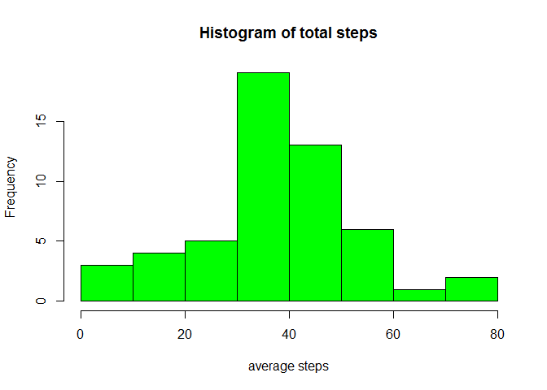
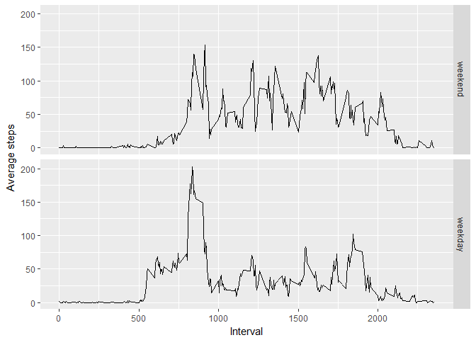

# PA1_template
KA  
May 30, 2017  


## R Markdown

This is an R Markdown document. Markdown is a simple formatting syntax for authoring HTML, PDF, and MS Word documents. For more details on using R Markdown see <http://rmarkdown.rstudio.com>.

When you click the **Knit** button a document will be generated that includes both content as well as the output of any embedded R code chunks within the document. You can embed an R code chunk like this:


## 1. Code for reading in the dataset and/or processing the data


```r
library(dplyr)
```

```
## Warning: package 'dplyr' was built under R version 3.3.3
```

```
## 
## Attaching package: 'dplyr'
```

```
## The following objects are masked from 'package:stats':
## 
##     filter, lag
```

```
## The following objects are masked from 'package:base':
## 
##     intersect, setdiff, setequal, union
```

```r
library(ggplot2)
```

```
## Warning: package 'ggplot2' was built under R version 3.3.3
```

```r
activity_data <- read.csv("~/Data science course/Coursera_R/Course5/Week2_project/data/activity.csv", stringsAsFactors = FALSE, na.strings = "NA")
activity_data$date <- as.Date(activity_data$date)
```

## 2. Histogram of the total number of steps taken each day


```r
Total_steps <- activity_data %>% group_by(date) %>% summarise(total=sum(steps, ma.rm=TRUE))
hist(Total_steps$total, main = "Histogram of total steps", xlab="Total steps", col = "green")
```

<!-- -->

## 3. Mean and median number of steps taken each day


```r
Total_steps_mean_median <- activity_data %>% group_by(date) %>% summarise(Mean_steps=mean(steps, na.rm=TRUE), median_steps=median(steps, na.rm=TRUE))
Total_steps_mean_median
```

```
## # A tibble: 61 × 3
##          date Mean_steps median_steps
##        <date>      <dbl>        <dbl>
## 1  2012-10-01        NaN           NA
## 2  2012-10-02    0.43750            0
## 3  2012-10-03   39.41667            0
## 4  2012-10-04   42.06944            0
## 5  2012-10-05   46.15972            0
## 6  2012-10-06   53.54167            0
## 7  2012-10-07   38.24653            0
## 8  2012-10-08        NaN           NA
## 9  2012-10-09   44.48264            0
## 10 2012-10-10   34.37500            0
## # ... with 51 more rows
```

## 4. Time series plot of the average number of steps taken


```r
ggplot(Total_steps_mean_median, aes(date,Mean_steps)) + geom_line() + ylab("Average steps")
```

```
## Warning: Removed 2 rows containing missing values (geom_path).
```

<!-- -->

## 5. The 5-minute interval that, on average, contains the maximum number of steps


```r
Avg_steps_interval <- activity_data %>% group_by(interval) %>% summarise(Avg_steps=mean(steps, na.rm=TRUE))
ggplot(Avg_steps_interval, aes(interval,Avg_steps)) + geom_line() + ylab("Average steps")
```

<!-- -->

## 6. Code to describe and show a strategy for imputing missing data

### Show missing values in data


```r
table(is.na(activity_data$steps))
```

```
## 
## FALSE  TRUE 
## 15264  2304
```

```r
summary(activity_data)
```

```
##      steps             date               interval     
##  Min.   :  0.00   Min.   :2012-10-01   Min.   :   0.0  
##  1st Qu.:  0.00   1st Qu.:2012-10-16   1st Qu.: 588.8  
##  Median :  0.00   Median :2012-10-31   Median :1177.5  
##  Mean   : 37.38   Mean   :2012-10-31   Mean   :1177.5  
##  3rd Qu.: 12.00   3rd Qu.:2012-11-15   3rd Qu.:1766.2  
##  Max.   :806.00   Max.   :2012-11-30   Max.   :2355.0  
##  NA's   :2304
```

### Replace NAs with zero

```r
activity_data_filled <- activity_data
activity_data_filled[is.na(activity_data_filled)] <- 0
summary(activity_data_filled)
```

```
##      steps             date               interval     
##  Min.   :  0.00   Min.   :2012-10-01   Min.   :   0.0  
##  1st Qu.:  0.00   1st Qu.:2012-10-16   1st Qu.: 588.8  
##  Median :  0.00   Median :2012-10-31   Median :1177.5  
##  Mean   : 32.48   Mean   :2012-10-31   Mean   :1177.5  
##  3rd Qu.:  0.00   3rd Qu.:2012-11-15   3rd Qu.:1766.2  
##  Max.   :806.00   Max.   :2012-11-30   Max.   :2355.0
```

## 7. Histogram of the total number of steps taken each day after missing values are imputed


```r
Total_steps_mean <- activity_data %>% group_by(date) %>% summarise(Mean_steps=mean(steps))
hist(Total_steps_mean$Mean_steps, main = "Histogram of total steps", xlab="average steps", col = "green")
```

<!-- -->

## 8. Panel plot comparing the average number of steps taken per 5-minute interval across weekdays and weekends


```r
weekdays1 <- c('Monday', 'Tuesday', 'Wednesday', 'Thursday', 'Friday')
activity_data_filled <- activity_data_filled %>%  mutate(wkday = factor((weekdays(activity_data_filled$date) %in% weekdays1), levels=c(FALSE, TRUE), labels=c('weekend', 'weekday')))
Avg_steps_interval_filled <- activity_data_filled %>% group_by(interval, wkday) %>% summarise(Avg_steps_filled = mean(steps))
ggplot(Avg_steps_interval_filled, aes(interval, Avg_steps_filled)) + geom_line() + facet_grid(wkday ~.) + ylab("Average steps") + xlab("Interval")
```

<!-- -->


